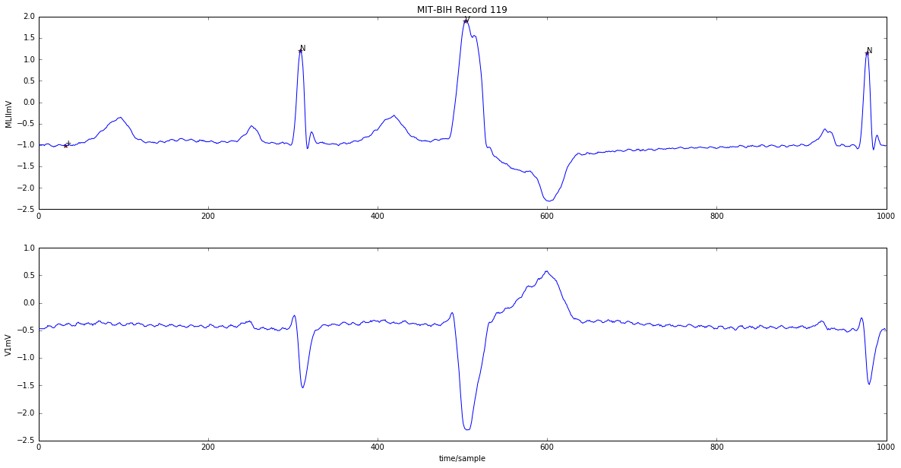

# ecg-classify
Classifying Heartbeat Arrhythmia using novel features (AR coefficients + RR distance). [Work in Progress]

### Introduction
In this project, I implement a heartbeat arrhythmia classification algorithm to separate normal heartbeats (N) from Ventricular Ectopic Beats (VEB). This work is based on the paper _"Heartbeats classification using QRS and T waves autoregressive features and RR interval features", Adnane M, Belouchrani A._ (see references).

The features used to train the model are:
- Auto-regressive coefficients of the QRS complex and T wave of the electrocardiogram.
- RR interbeat distance.

Normal Beats: 
VEB Beats: 

### Procedure
#### Pre-processing
- A 3rd order high-pass Butterworth filter is used to eliminate DC componant and baseline wander.
- A 3rd order band-reject Butterworth filter is used to eliminate the 60 Hz AC interference.
- A 4th order low-pass Butterworth filter is used to high-freq artifacts like EMG noise.

#### Features Extraction
- We use the Levinson algorithm to extract AR coefficients from ECG signal.
- A basic substraction gives the RR interdistance.

#### Training Day
SVM classifiers give good results for now. I'll stick to them while trying to improve hyper-parameters before going to anything else (e.g. Neural Nets).

### Result
For the time being (2017), results are reaching those obtained by state-of-the-art methods with accuracy metric 97.02% (overall), and 98.86% for subject specific scheme (See references).

### Dataset
- [MIT/BIH Arrhythmia Database](https://www.physionet.org/physiobank/database/mitdb/)

### References
- [Adnane M, Belouchrani A. Heartbeats classification using QRS and T waves autoregressive features and RR interval features. Expert Systems. 2017;34:e12219.](https://doi.org/10.1111/exsy.12219)